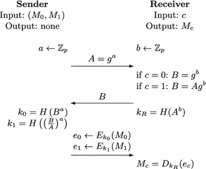
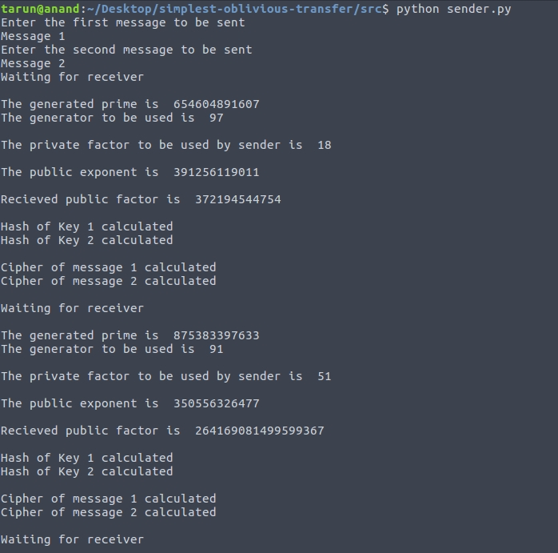
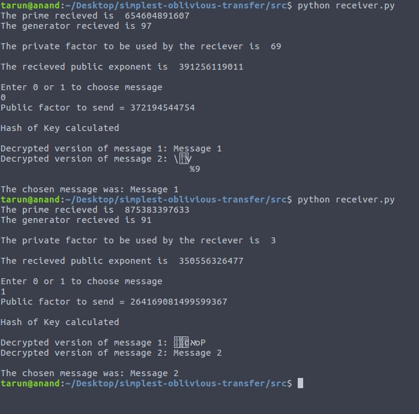
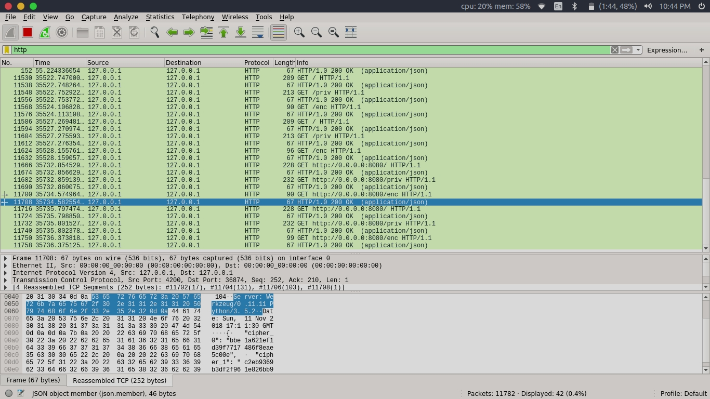
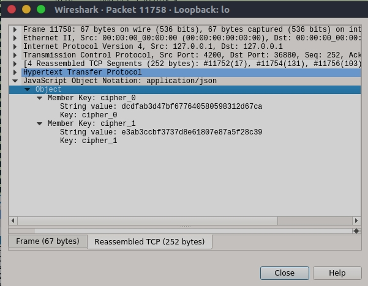
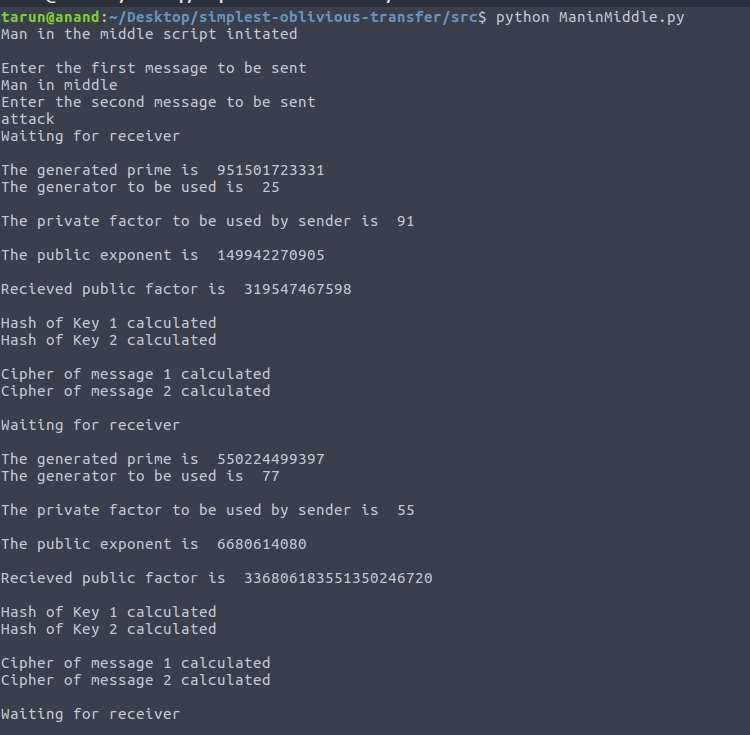
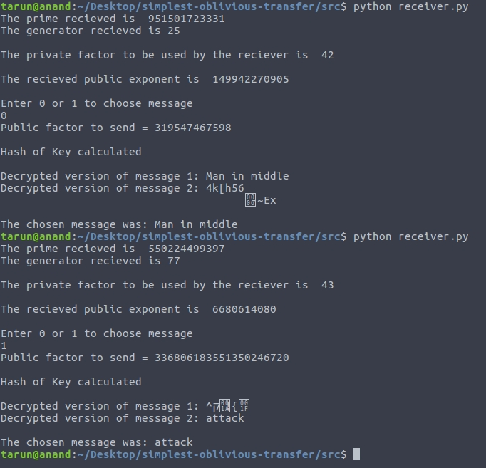

## The Simplest Protocol for Oblivious Transfer

### Team Members:
Tarun Anand - 16CO147

Archit Pandey - 16CO153

### Tools used:
1. Python
2. Wireshark

### Abstract
[Reference](https://link.springer.com/chapter/10.1007/978-3-319-22174-8_3)  
An oblivious transfer (OT) protocol is a type of protocol in which a sender transfers one of potentially many pieces of information to a receiver, but remains oblivious as to what piece (if any) has been transferred. The receiver is also oblivious of the non accepted messages transmitted by the sender.

Oblivious Transfer is a fundamental building block for more complex cryptographic protocols such as secure multiparty computation protocols.

The paper we have chosen describes the simplest and most efficient protocol for 1-out-of-n OT to date, which is obtained by tweaking the Diffie-Hellman key-exchange protocol.


### Diffie-Hellman Key Exchange
[Reference](http://www.math.ucla.edu/~baker/40/handouts/rev_DH/node1.html)  
Diffie-Hellman is an algorithm used to establish a shared secret between two parties. It is primarily used as a method of exchanging cryptography keys for use in symmetric encryption algorithms like AES.  

  

Let's assume that Alice wants to establish a shared secret with Bob.


```math
1. Alice and Bob agree on a prime number, p, and a base, g.
2. Alice chooses a secret integer a and computes A = g^a mod p.
3. Bob chooses a secret integer b and computes B = g^b mod p.
4. Alice sends A to Bob and Bob sends B to Alice.
5. To obtain the shared secret, Alice computes s = B^a mod p.
6. To obtain the shared secret, Bob computes s = A^b mod p.
```
The algorithm is secure because the values of a and b, which are required to derive s are not transmitted across the wire at all.

### Simplest Oblivious Transfer Protocol


The above image demonstrates the working of the implemented oblivious transfer protocol. This version of OTT is based upon the Diffie-Hellman Key Exchange. The security of this protocol is dependent upon the security of the Diffie-Hellman protocol.  
The steps are as follows-
```math
1. The sender receives two messages M0 and M1.
2. The receiver has an input bit c which is either 0 or 1.
3. The sender chooses secret integer a.
4. The receiver chooses secret integer b.
5. The sender calculates g^a and sends it to the receiver.
6. Based on the choice of c, B calculated by the receiver is either g^b or Ag^b.
7. The sender receives B and calculates k0 and k1.
8. While decrypting e0 and e1, the receiver is only successful at decrypting ec.
```

We use wireshark to capture the packets while being transit and show that it is not possible to obtain any of the possible messages which are being transmitted.
### Man In The Middle Attack on DH Key Exchange
[Reference](https://www.coursera.org/lecture/asymmetric-crypto/man-in-the-middle-attack-Q4XgE)  
The Diffie-Hellman key exchange is vulnerable to a man-in-the-middle attack. In this attack, an opponent Carol intercepts Alice's public value and sends her own public value to Bob. When Bob transmits his public value, Carol substitutes it with her own and sends it to Alice. Carol and Alice thus agree on one shared key and Carol and Bob agree on another shared key. After this exchange, Carol simply decrypts any messages sent out by Alice or Bob, and then reads and possibly modifies them before re-encrypting with the appropriate key and transmitting them to the other party. This vulnerability is present because Diffie-Hellman key exchange does not authenticate the participants.

Since our version of oblivious transfer is based on the Diffie-Hellman key exchange, it is also vulnerable to a man in the middle attack. We implemented a man in the middle script to demonstrate this vulnerability.

### Scope for Future Work
Modern implementations of Diffie-Hellman is typically preceded by authentication of both the users by use of a public and private key. This prevents a man in the middle attack from taking place. Utilizing this version of the Diffie-Hellman algorithm will also prevent a man in the middle attack from affecting oblivious transfer.
Implementing oblivious transfer using this modified Diffie-Hellman can be taken up as future progress with respect to this project.
### Directory Structure
1. img - Directory that contains all the images and Screenshots
2. unused - Contains the code from the initial approach to completing the project
3. src/DiffieHellman.py - Code for the Diffie-Hellman protocol
4. src/encrypt.py - Code pertaining to the cryptographic functions utilized
5. src/RabinMiller.py - Code that generates prime numbers utilized in the oblivious transfer.
6. src/sender.py - OTT sender
7. src/receiver.py - OTT receiver
8. src/ManinMiddle.py - OTT man in the middle

### Steps to run the code
1. Ensure python3 and [python3-pip](https://pip.pypa.io/en/stable/installing/) are installed .
2. Run the following command
```math
pip install -r requirements.txt
```
3. Navigate to the src Directory
4. To run the DiffieHellman
```math
python DiffieHellman.py
```
5. To run the sender
```math
python sender.py
```
6. To run the receiver
```math
python receiver.py
```
5. To run the Man in the Middle attack
```math
python ManinMiddle.py 
```
### Screenshots

Sender


Receiver



Wireshark packet capture


Captured Data


Man in the Middle

Man in the Middle script


Affected Receiver

