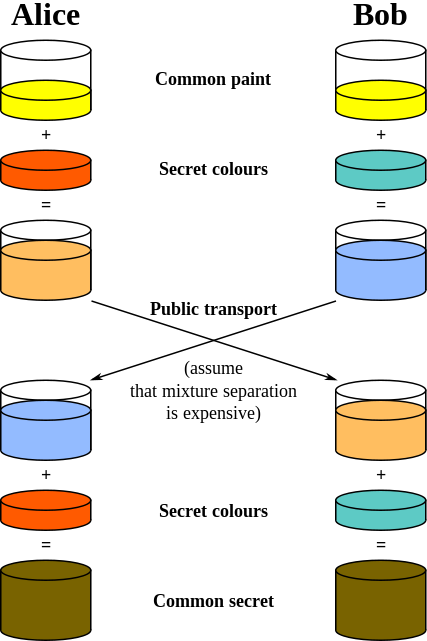

## The Simplest Protocol for Oblivious Transfer

### Team Members:
Tarun Anand - 16CO147

Archit Pandey - 16CO153

### Tools used:
1. Python

### Abstract:
[Reference](https://link.springer.com/chapter/10.1007/978-3-319-22174-8_3)  
Oblivious Transfer (OT) is the fundamental building block of cryptographic protocols.An oblivious transfer (OT) protocol is a type of protocol in which a sender transfers one of potentially many pieces of information to a receiver, but remains oblivious as to what piece (if any) has been transferred. The receiver is also oblivious of the non accepted messages transmitted by the sender.

The paper we have chosen describes the simplest and most efficient protocol for 1-out-of-n OT to date, which is obtained by tweaking the Diffie-Hellman key-exchange protocol.


### Diffie-Hellman Key Exchange
[Reference](http://www.math.ucla.edu/~baker/40/handouts/rev_DH/node1.html)  
Diffie-Hellman is an algorithm used to establish a shared secret between two parties. It is primarily used as a method of exchanging cryptography keys for use in symmetric encryption algorithms like AES.  

  

Let's assume that Alice wants to establish a shared secret with Bob.


```math
1. Alice and Bob agree on a prime number, p, and a base, g.
2. Alice chooses a secret integer a and computes A = g^a mod p.
3. Bob chooses a secret integer b and computes B = g^b mod p.
4. Alice sends A to Bob and Bob sends B to Alice.
5. To obtain the shared secret, Alice computes s = B^a mod p.
6. To obtain the shared secret, Bob computes s = A^b mod p.
```
The algorithm is secure because the values of a and b, which are required to derive s are not transmitted across the wire at all.
### Directory Structure

### Screenshots

### Graph
